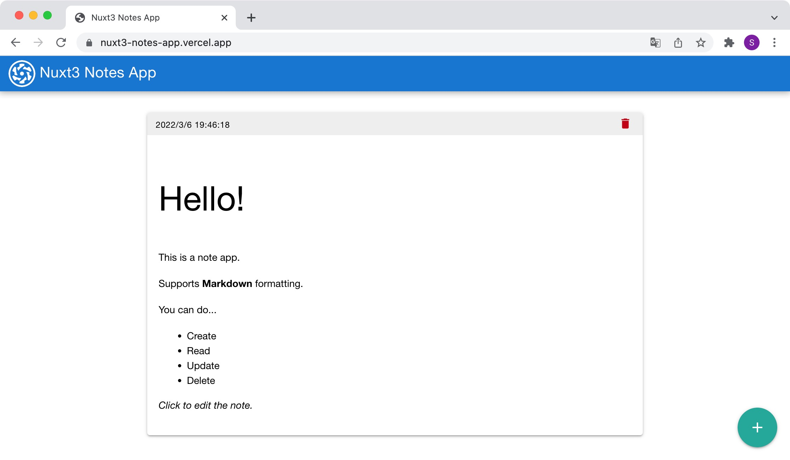

# Nuxt 3 Notes App


[](https://opensource.org/licenses/MIT)

Nuxt 3 beta で構築したノートアプリケーション



## Description

Nuxt 3 beta と Quasar で作成したノートアプリです。基本的な CRUD 操作が可能です。ノートは Markdown 形式の入力をサポートしています。記入したノートの内容は LocalStorage に自動保存することで永続化しています。

**_ACCESS THIS APP:_**
https://nuxt3-notes-app.vercel.app/

## Features

- Markdown 形式でノートを取ることができます
- ノートの内容は LocalStorage に自動保存されます

## Requirement

- Node.js v14
- Yarn v1

<!-- ## Usage

1. Usage
2. Usage
3. Usage -->

## Installation

```sh
# Clone
git clone https://github.com/shinya-hara/nuxt3-notes-app.git

cd nuxt3-notes-app

# Install dependencies
yarn install

# Run dev server
yarn dev
# => http://localhost:3000
```

## Author

[shinya-hara](https://github.com/shinya-hara)

## License

[MIT](https://github.com/shinya-hara/nuxt3-notes-app/blob/master/LICENSE)
